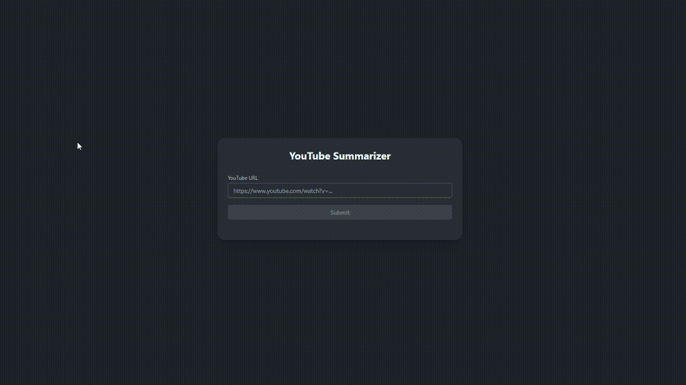

# Yts (YouTube Summarize)

**Yts** is an open source Elixir Phoenix LiveView prototype that takes a YouTube video and generates a textual summary. It uses modern ML tools like OpenAI Whisper and Facebook's BART for transcription and summarization.

## How it works

When a URL is entered, it is validated and the YouTube video ID is extracted to display the video thumbnail. Meanwhile, the server downloads the video using the `yt-dlp` CLI tool.  
Once the download is complete, `ffmpeg` encodes the audio and splits it into 60-second chunks so that OpenAI Whisper can generate text transcriptions.  
All text chunks are then joined and passed through Facebook's `BART` model to generate a summary.

## Try it out 

To start your Phoenix server:

* Run `mix setup` to install and setup dependencies
* Start Phoenix endpoint with `mix phx.server` or inside IEx with `iex -S mix phx.server`

Now you can visit [`localhost:4000`](http://localhost:4000) from your browser.

Ready to run in production? Please [check our deployment guides](https://hexdocs.pm/phoenix/deployment.html).

## Technology used

* Elixir: https://elixir-lang.org/
* Phoenix/Liveview: https://www.phoenixframework.org/
* yt-dlp: https://github.com/yt-dlp/yt-dlp
* ffmpeg: https://ffmpeg.org/
* Bumblebee: https://github.com/elixir-nx/bumblebee
* Bart: https://huggingface.co/facebook/bart-large-cnn
* Whisper: https://huggingface.co/openai/whisper-large-v3-turbo
